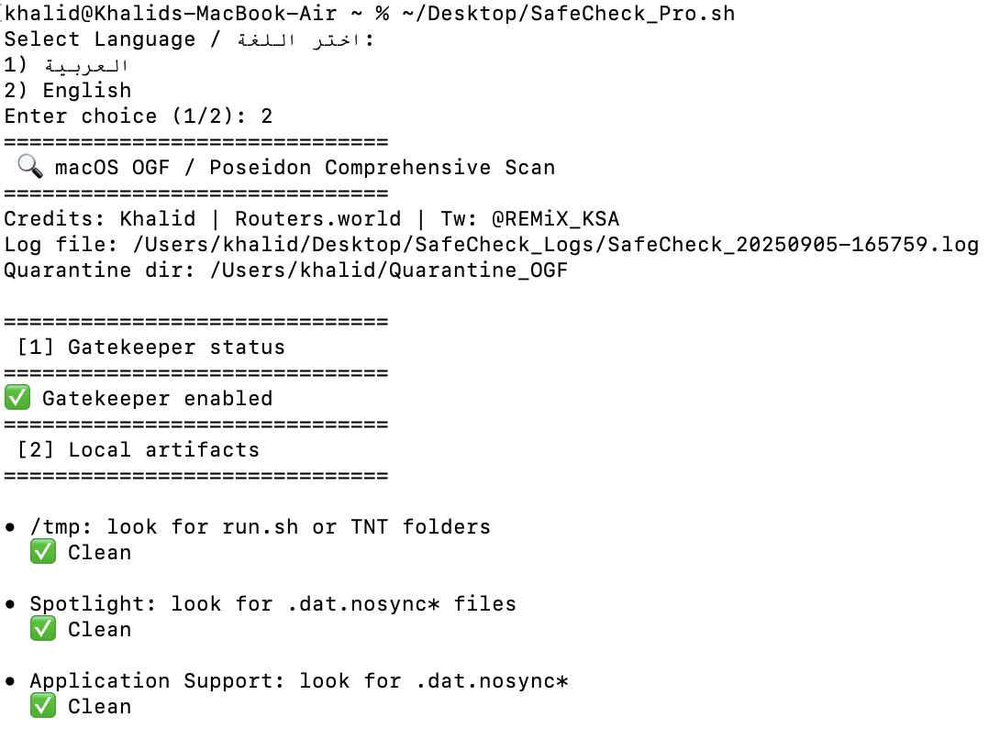

# SafeCheck Pro (macOS) — OGF/Poseidon Quick Scan

> A bilingual (Arabic/English) macOS shell script to quickly triage OGF/Poseidon artifacts: checks Gatekeeper status, hunts local indicators, verifies DMG hashes against BrokenStones `badfiles.txt`, inspects mounted volumes, optionally runs a helper script, and compares active connections to IPs from community intel (rentry).

<p align="center">
  
  
  <a href="#license"></a>
</p>

---

## ✨ Features

- 🌍 **Bilingual UX (Arabic/English)** – language prompt at start
- 🔒 **Gatekeeper status** check
- 🗂️ **Local artifacts sweep**  
  - `/tmp` for `run.sh` and `tnt*`  
  - Spotlight & Application Support for `.dat.nosync*`  
  - LaunchAgents/Daemons listing (light triage)  
- 📦 **DMG hash check** – compare recursively found `*.dmg` against BrokenStones `badfiles.txt`
- 🕵️ **OGF filename hunt** – searches for *“Open Gatekeeper friendly”* (also inside `/Volumes`)
- ⚙️ **Optional helper** – runs BrokenStones helper script inside `~/Downloads`
- 🌐 **Rentry IPs match** – checks active connections against known IPs
- 🛡️ **Auto-quarantine** – moves suspicious hits to timestamped folder
- 📝 **Comprehensive logs** – saved under `~/Desktop/SafeCheck_Logs`

> ⚠️ **Research tool** only — not a replacement for EDR/AV or professional IR.

---

## 🆕 What’s New in v1.1
- Interactive **Verbose Mode** (choose full detail vs. summary).
- Full **`.app` bundle scanning** with TeamID/Authority/Gatekeeper checks.
- One-line summaries per app + final statistics (OK/Warning/Quarantined).
- Skip system volumes in `/Volumes` (optional).
- Cleaner outputs, improved parsing, unified MD5 handling.

See full [CHANGELOG.md](CHANGELOG.md) for details.

---

## 🖥️ Requirements

- macOS 12+ (works on newer versions too)
- `bash`, `curl`, `md5` (or `md5sum`), `lsof`, `file`, `stat`
- Terminal app with **Full Disk Access** (recommended for wider coverage)

---

## 🚀 Quick Start

```bash
# Clone
git clone https://github.com/ikhd/safecheck-macos.git
cd safecheck-macos

# Make executable
chmod +x SafeCheck_Pro.sh

# Run
./SafeCheck_Pro.sh
```
---

## ⚙️ Configuration

- You can customize behavior by editing variables at the top of the script:

```bash
SCAN_DIRS=("$HOME/Downloads" "$HOME/Desktop")  # directories to scan recursively
CHECK_MOUNTED_VOLUMES=true                    # scan /Volumes for OGF
RUN_BROKENSTONES_SCRIPT=true                  # run BrokenStones helper
CHECK_RENTRY_IPS=true                         # fetch + check IPs from rentry
AUTO_QUARANTINE=true                          # move suspicious files automatically
QUAR_DIR="$HOME/Quarantine_OGF"               # quarantine folder
LOG_DIR="$HOME/Desktop/SafeCheck_Logs"        # log folder
BADLIST_URL="https://brokenstones.is/static/scripts/badfiles.txt"
BROKEN_SCRIPT_URL="https://brokenstones.is/static/scripts/check_badfiles.sh"
RENTRY_URLS=("https://rentry.co/ogf_malware" "https://rentry.co/ogf_malware_behavior")
```

---

## ⚠️ Safety Notes & Limitations

- 🔗 **Remote content**: downloads community lists (`badfiles.txt`, rentry IPs) and may run a helper script. *Review URLs before enabling.*  
- 🕵️ **Heuristics**: names like *“Open Gatekeeper friendly”* are only indicators, not verdicts.  
- 📦 **No deletion**: suspicious files are moved to quarantine (restore if needed).  
- 🌐 **Network view**: `lsof` may require elevated privileges to see all processes.  

---

## 🛠️ Roadmap

- `--lang`, `--no-network`, `--read-only` flags (non-interactive mode)  
- Hardened quarantine (xattrs, immutable)  
- Codesigned release + Homebrew Tap  
- Optional JSON output  

---

## 🤝 Contributing

See [CONTRIBUTING.md](CONTRIBUTING.md).  
Pull requests for new indicators and flags are welcome.  
⚠️ Please avoid adding destructive actions.  

---

## 🔐 Security

See [SECURITY.md](SECURITY.md).  
If you discover a vulnerability or data-loss bug, please report it privately.  

---

## 📜 License

Released under the [MIT License](LICENSE).  

**Credits:** Khalid — [Routers.world](https://routers.world) — X: [@REMiX_KSA](https://x.com/REMiX_KSA)

---
<p align="center">
  
</p>
